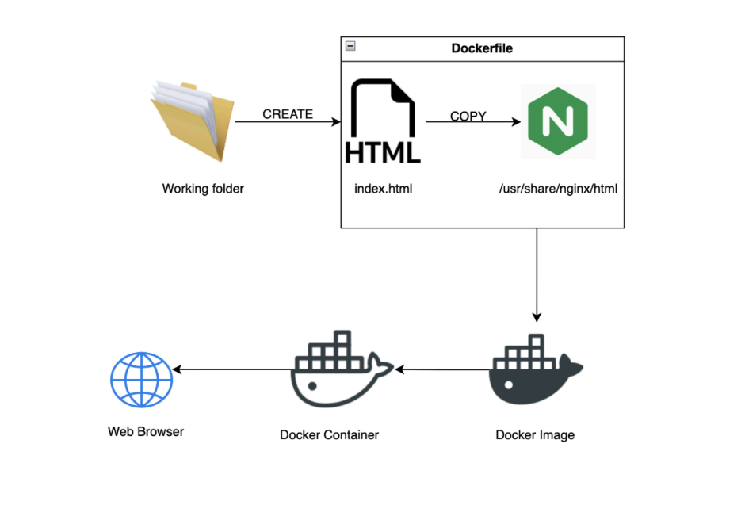

# DockerContainerisationProject
This project is a demonstration on how to build images and use them as a template to create a container to host a static HTML webpage on your local host machine.

Below is the flow of Mini Project :

